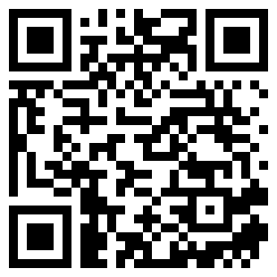

# nostr-qrchat

  <b><i>ephemeral, anonymous chat via QR codes over nostr</i></b> 

  

Use cases:

- put a QR code on your letter box so people at your door can still contact you when you are not at home without any PII
- put QR codes anywhere where people may want to open instant support chat sessions
- put QR code at your website to let people chat with you
- ...

Every QR code is linked to a specific token. This has following advantages:

- You know which QR code was used which tells you the location of people
  (assuming they didn't save the token but this can be solved using [TOTPs](https://en.wikipedia.org/wiki/Time-based_one-time_password))
- You can invalidate existing QR codes to prevent spam
- You can configure prompts per QR code

## Setup

1. Clone repository: `git clone git@[git.ekzyis.com:55680]:ekzyis/nostr-qrchat`
2. Build binary: `go build`
3. Enter your bech32 nostr pubkey (npub) as `NOSTR_PUBKEY` in `.env`
4. Generate random token: `openssl rand -hex 8 >> tokens`
5. Run `./nostr-qrchat`
